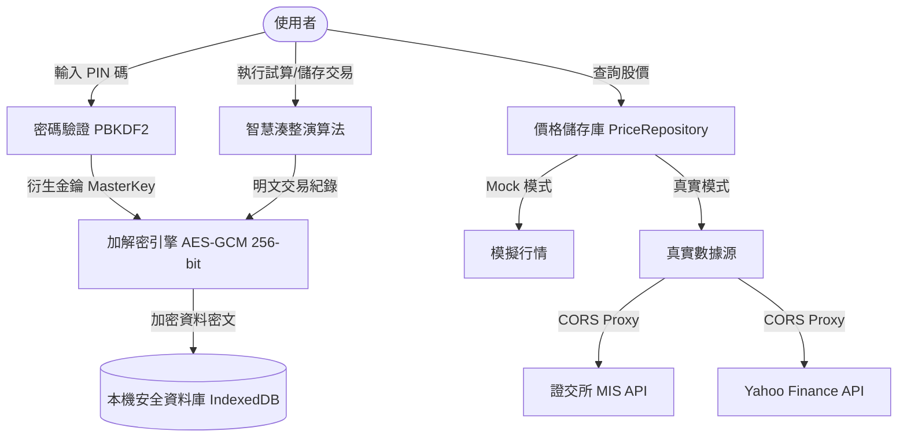

# 📈 台股整數化投資智慧試算工具 (Taiwan Stock Integer Investment Optimizer Tool)

[](https://react.dev/)
[](https://tailwindcss.com/)
[](https://vite.dev/)
[](LICENSE)

這是一款專為台灣股市投資人設計的**本地端隱私安全試算工具**。它基於強大的核心湊整演算法，輔助投資人在買入個股（特別是零股交易）時，精準估算「擬購入股數」，使交易後的**持有均價**與**總股數**皆為無小數點的偶數整數，從而實現精確的資產管理與記帳偏好。

同時，本工具秉持「**隱私至上，資料本地化**」原則，所有交易明細在寫入瀏覽器 IndexedDB 前，皆會於前端進行高級軍規加密（AES-GCM 256-bit），在完全不犧牲便利性的前提下，100% 捍衛您的資產隱私。

---

## 🌟 核心特色

### 1. 🎯 智慧湊整優化演算法 (The Optimizer)
提供三種不同的配股推薦策略，靈活滿足您的投資計畫：
*   **均價整數優先 (Perfect Rounding)**：優先考慮使買入後平均成本能夠是整數，甚至是偶數整數（例如：持有均價剛好為 $150.00$ 元），消除討人厭的浮點數。
*   **整張股數優先 (Quantity Rounding)**：在均價四捨五入可視為整數的前提下，優先推薦交易後能湊滿 $1,000$ 股（整張）或 $100$ 股倍數的方案。
*   **預算最大化 (Budget Maximization)**：在均價偏差小於 $1.0$ 的合理範圍內，最大化利用您給定的預算上限，降低手續費摩擦比例。

### 2. 🔒 零信任本地端加密儲存 (Zero-Knowledge Local Storage)
*   **PBKDF2 金鑰衍生**：使用 PBKDF2 演算法（高達 100,000 次雜湊迭代）與隨機 Salt，將您的自訂 PIN 碼衍生為 256 位的 AES-GCM 安全金鑰。
*   **AES-GCM (256-bit) 加密**：所有交易紀錄在寫入資料庫前皆在瀏覽器端加密，即使瀏覽器資料被惡意導出，也無法破解您的資產內容。
*   **無伺服器架構**：不儲存任何使用者密碼或明文資料於雲端，完全在您的本機運行。

### 3. 💸 多券商與手續費客製化 (Broker Management)
*   支援新增、修改多個證券商設定檔。
*   可針對不同的券商設定「手續費折扣」（例如：28 折、6 折等）與「最低起收手續費限制」（如：零股最低 1 元、整股最低 20 元）。
*   試算時自動代入預設券商費率，提供最真實的成交摩擦成本估算。

### 4. 🧓 老花眼與高齡友善設計 (Accessibility)
*   專為長輩或長時間看盤的使用者貼心設計，支援**一鍵字型縮放功能**。
*   提供「標準」、「略大」、「放大」、「特大」四種字型大小切換（可達原字型 $145\%$ 大小），保護視力，確保股價與金額等關鍵數字清晰易讀。

### 5. ☁️ 加密備份與還原 (Encrypted Backup & Restore)
*   支援一鍵匯出高度加密的 `.json` 備份檔案，保障您在跨裝置或清除瀏覽器快取時的資料安全性。
*   還原時必須輸入與匯出時相同的 PIN 碼，安全無虞。

### 6. 🌐 雙模數據源與 CORS 代理 Fallback
*   **真實行情**：串接證交所 (TWSE) 即時 MIS 報價 API，並以 Yahoo Finance 作為備用方案。
*   **CORS 代理 Fallback**：內建自動切換代理機制（`corsproxy.io` ➡️ `allorigins`），完美克服瀏覽器跨來源資源共用 (CORS) 限制。
*   **模擬行情 (Mock Mode)**：開發者或測試使用者可隨時切換至模擬數據模式，提供隨機合理波動之價格，免去真實 API 的限流困擾。

---

## 📐 系統架構與資料流

本工具完全在瀏覽器沙盒中運行，整體系統架構與加密流程如下：



---

## 🛠️ 開發與快速啟動

### 專案依賴
*   **核心框架**：React 19, TypeScript
*   **建置工具**：Vite 6
*   **CSS 樣式**：Tailwind CSS v4.0 (採用原生 Vite 插件 `@tailwindcss/vite` 配置)
*   **資料儲存**：`idb` (Promisified IndexedDB API wrapper)
*   **圖示庫**：`lucide-react`
*   **PWA 功能**：`vite-plugin-pwa`

### 1. 安裝套件
請先確保您的電腦已安裝 [Node.js](https://nodejs.org/) (建議 v18 以上)。在專案根目錄下執行：
```bash
npm install
```

### 2. 啟動開發伺服器
您可以直接執行 `start.bat`（適合 Windows 使用者），或是手動運行下方命令：
```bash
npm run dev
```
啟動後，瀏覽器將會自動打開 `http://localhost:5173/stock_tool/`。

### 3. 建置專案打包
若要建立生產環境的靜態檔案：
```bash
npm run build
```
打包後的檔案將會生成在 `dist/` 目錄中。

### 4. 部署至 GitHub Pages
專案內建 `gh-pages` 部署腳本，您只需執行：
```bash
npm run deploy
```
系統會自動建置程式碼，並將其推送到您設定的遠端 Git 倉庫的 `gh-pages` 分支。

---

## 📦 資料庫結構 (Database Schema)

資料庫採用 IndexedDB 作為本機存儲媒介。共有三個主要 Object Store：

| Store 名稱 | 欄位鍵值 | 儲存內容描述 | 安全層級 |
| :--- | :--- | :--- | :--- |
| `app_settings` | `key` | 儲存基本系統參數與 PBKDF2 的隨機 `auth_salt` 與用來驗證 PIN 碼的雜湊驗證簽章 | ⚠️ 部分欄位加密 / 部分明文 |
| `broker_profiles` | `id` | 使用者設定的券商資料、手續費折扣、最低費用 | 🔓 明文儲存 |
| `trade_history` | `id` | 使用者已儲存之交易紀錄。包含股票代號（明文索引）以及交易數量、單價、手續費等（加密密文） | 🔒 軍規加密 (AES-GCM) |

---

## 🚀 未來發展藍圖 (Roadmap)

*   **階段一：複數持股投資組合優化** 
    支援多檔個股的資產配置目標比例試算。使用者輸入理想配置百分比（例如：台積電 40%, 鴻海 30%...），系統一鍵計算使整體投資組合最接近目標比例且均價最優的購買組合。
*   **階段二：定期定額湊整歷史回測**
    引入台股歷史股價數據，模擬並回測「智慧湊整定期定額」與「傳統定期定額」的實際扣款成果。量化比較兩者在均價整平度、與手續費摩擦成本上的磨損差異。
*   **階段三：風險評估與績效分析**
    計算投資組合的 Beta 值、波動度與夏普值（Sharpe Ratio），並與台灣加權指數（大盤）進行自動績效對比，評估整數化持股偏好在風險分散上的實際表現。
*   **階段四：證券商 API 自動下單串接**
    與合作國內券商 API 進行串接，實現試算完畢後「一鍵送出委託單」，讓智慧配股從算帳、記帳，跨越到自動下單交易閉環。

---

## 📄 授權條款 (License)

本專案採用 **MIT License** 進行授權。詳情請參閱專案中的 [LICENSE](LICENSE) 檔案。
